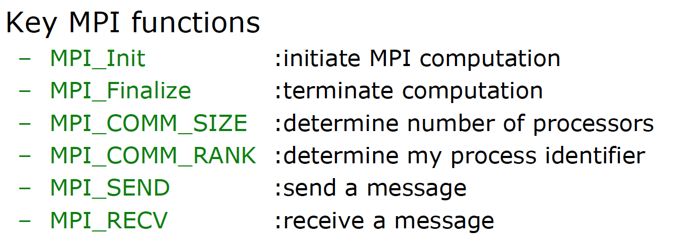
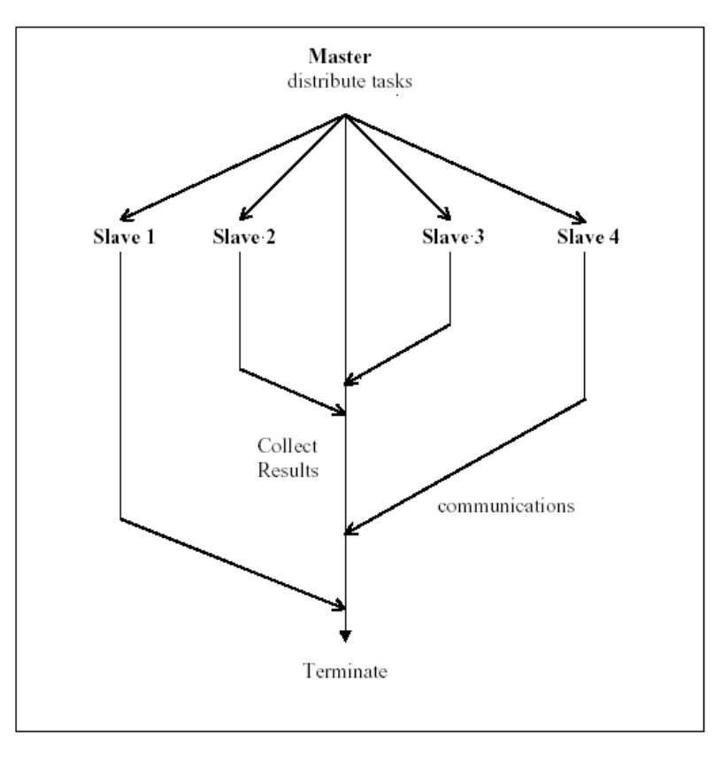
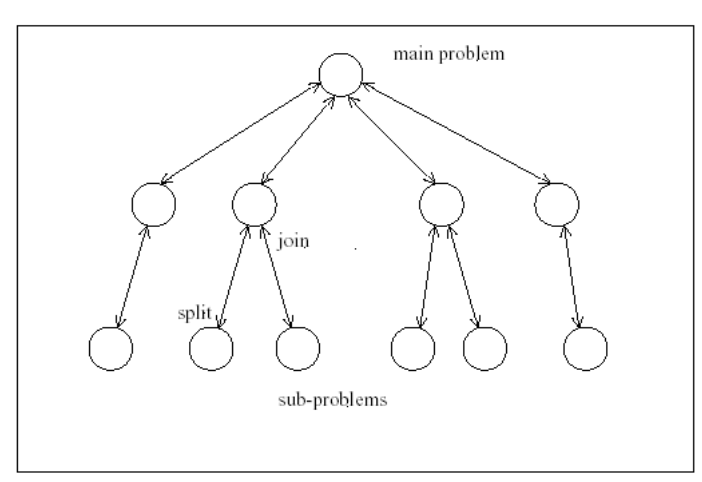
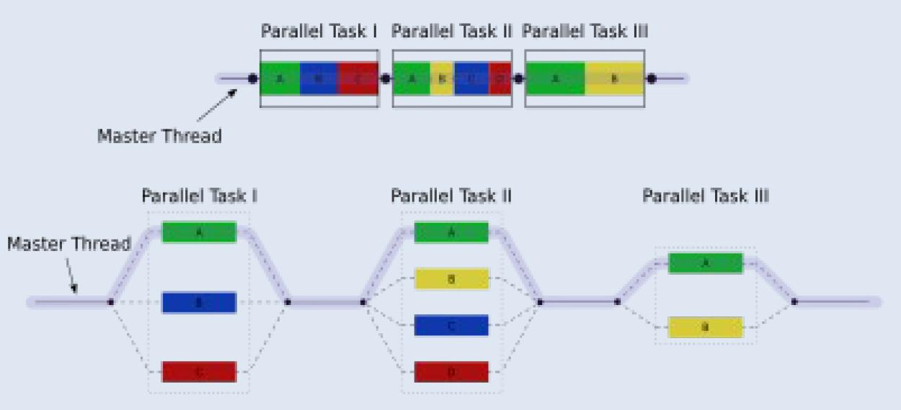

# Cluster and Cloud Computing

## Contents

- [Lecture 1](#lecture-1)
- [Lecture 3](#lecture-3)
- [Lecture 4](#lecture-4)

---

## Lecture 1

**Computing and Communication Technologies (r)evolution: 1960-:**


- **Centralised system:** Single physical (centralised) system. All resources (processors, memory and storage) fully shared and tightly coupled within one integrated OS
- **Parallel system:** All processors (_each processor in all the processors_)either tightly coupled with centralised shared memory or loosely coupled with _distributed memory_(refer to pictures below). Interprocess communication through shared memory or throughsome form of message passing


- **Distributed system:** Multiple autonomous computers with their own private memory, communicating through some form of message passing over a computer network
- **Cloud computing:** It is distributed computing over a network and has the ability to run a program on many connected computers at the same time.

**Cloud Characteristics:**

- _On-demand self-service_: A consumer can provision computing capabilities as needed without requiring human interaction with each service provider.
- _Networked access_: Capabilities are available over the network and accessed through standard mechanisms that promote use by heterogeneous client platforms.
- _Resource pooling_: The provider's computing resources are pooled to serve multiple consumers using a multi-tenant model potentially with different physical and virtual resources that can be dynamically assigned and reassigned according to consumer demand.
- _Rapid elasticity_: Capabilities can be elastically provisioned and released, in some cases automatically, to scale rapidly upon demand.
- _Measured service_: Cloud systems automatically control and optimize resource use by leveraging a metering capability at some level of abstraction appropriate to the type of service.

**Grid Architecture:**


## Lecture 3

**Compute Scaling:**

- _Vertical Computational Scaling_ (quality,improving performance of processors): Have faster processors, Limits of fundamental physics/matter (nanoCMOS)
- _Horizontal Computational Scaling_(quantity of processors): Have more processors (Easy to add more, cost increase not so great,but harder to design, develop, test, debug, deploy, manage, understand)

**ADD MORE:**

- Single machine multiple cores
- Loosely coupled cluster of machines (Pooling/sharing of resources)
- Tightly coupled cluster of machines (Typical HPC/HTC set-up,SPARTAN)
- Widely distributed clusters of machines
- Hybrid combinations of the above


- **T(1)** = time for serial computation
- **T(N)** = time for N parallel computations
- **S(N)** = speed up
- Proportion of speed up depends on parts of program that can’t be parallelised

**Amdahl's Law:**


- If 95% of the program can be parallelized, the theoretical maximum speedup using parallel computing would be 20×, no matter how many processors are used
- If the non-parallelisable part takes 1 hour, then no matter how many cores you throw at it it won’t complete in <1 hour.

****Overheads:** overhead is any combination of excess or indirect computation time, memory, bandwidth, or other resources that are required to perform a specific task (It's like when you need to go somewhere, you might need a car. But, it would be a lot of overhead to get a car to drive down the street, so you might want to walk. However, the overhead would be worth it if you were going across the country.)


**Gustafson-Barsis's Law:** programmers tend to set the size of problems to use the available equipment to solve problems within a practical fixed time. _Faster (more parallel) equipment available, larger problems can be solved in the same time_

**Computer Architecture:**

- CPU for executing programs
- Memory that stores/executing programs and related data
- I/O systems (keyboards, networks, …)
- Permanent storage for read/writing data into out of memory(hard disk)
- Balance of all of these
- different ways to design/architect computers


### Approaches for Parallelism
**Explicit vs Implicit Parallelisation:**

- _Implicit Parallelism_: Supported by parallel languages and parallelizing compilers that take care of identifying parallelism, the scheduling of calculations and the placement of data
- _Explicit Parallelism_:the programmer is responsible for most of the parallelization effort such as task decomposition, mapping tasks to processors, inter-process communications

**Hardware Parallelisation:**


- Cache: much faster than reading/writing to main memory,instruction cache, data cache (multilevel) and translation lookaside buffer used for virtual-physical address translation

Parallelisation by adding extra CPU to allow more instructions to be processed per cycle.


Multiple cores that can process data and perform computational tasks in parallel(L1 cache on single cores; L2 cache on pairs of cores; L3 cache
shared by all cores, (higher hit rates
but potentially higher latency))


Two (or more) identical processors connected to a single, shared main memory, with full access to all I/O devices, controlled by a single OS instance that treats all processors equally. Each processor executes different programs and works on different data but with capability of sharing common resources (memory, I/O device, …). Processors can be connected in a variety of ways: buses, crossbar switches, meshes. More complex to program since need to program both for CPU and inter-processor communication (bus).


**Non-uniform memory access (NUMA)** provides speed-up by allowing a processor to access its own local memory faster than non-local memory. Improved performance as long as data are localized to specific processes/processors. Key is allocating memory/processors to avoid scheduling/locking and (expensive) inter-processor communication

**OS Parallelism:**

- parallel(real parallel) vs interleaved semantics(context switch)
- Compute parallelism (Native threads, Fork, Spawn, Join; Green threads Scheduled by a virtual machine instead of natively by the OS)
- Data parallelism(Caching)

**Software Parallelism:**

- Deadlock – processes involved constantly waiting for each other
- Livelock – processes involved in livelock constantly change with regard to one another, but none are progressing

**Message Passing Interface:**(message passing in parallel
systems)



Data Parallelism


**Distribution system challenges:** A distributed system is one in which the failure of a computer you didn't even know existed can render your own computer unusable (**Assumptions)

****Bandwidth:** Bandwidth is the capacity of a wired or wireless network communications link to transmit the maximum amount of data from one point to another over a computer network or internet connection in a given amount of time -- usually one second.

****Topology:** A network topology is the arrangement of a network, including its nodes and connecting lines. There are two ways of defining network geometry: the physical topology and the logical (or signal) topology.

- physical topology: the actual geometric layout of workstations(star or ring network)
- some networks are physically laid out in a star configuration, but they operate logically as bus or ring networks

**Incorrected Assumptions in distributed system:**

```
1. The network is reliable
2. Latency is zero
3. Bandwidth is infinite
4. The network is secure
5. Topoogy doesn't change
6. There is one administrator
7. Transport cost is zero
8. The network is homogeneous
9. Time is ubiquitous
```

**Design Stages of Parallel Programs:**(through steps)

1. Partitioning: Decomposition of _computational activities(procedures) and data_ into smaller tasks(Master-worker,pipeline, divide and conquer)
2. Communication: Flow of information and coordination among tasks that are created in the partitioning stage
3. Agglomeration(collection of things):
    - Tasks and communication structure created in the above stages are evaluated for performance and implementation cost
    - Tasks may be grouped into larger tasks to improve communication
    - Individual communications can be bundled
4. Mapping / Scheduling: Assigning tasks to processors such that job completion time is minimized and resource utilization is maximized

**Master-Slave model:** Master decomposes the problem into small tasks(different processes), distributes to workers and gathers partial results to produce the final result


**Single-Program Multiple-Data:**

- Each process executes the same piece of code, but on different parts of the data
- Data is typically split among the available processors


**Data Pipelining:** Suitable for applications involving multiple stages of execution, that typically operate on large number of data sets.


**Divide and Conquer:**

- A problem is divided into two or more sub problems, and each of these sub problems are solved independently, and their results are combined
- 3 operations: split, compute, and join
- Master-slave is like divide and conquer with master doing both split and join operation



**Speculative Parallelism:**(Used when it is quite difficult to achieve parallelism through the previous paradigms)

- Problems with complex dependencies - use “look ahead “execution
- If the value of V is predictable, we can execute C speculatively using a predicted value in parallel with P.

    - If the prediction turns out to be correct, we gain performance since C doesn’t wait for P anymore.
    - If the prediction is incorrect (which we can find out when P completes), we have to take corrective action, cancel C and restart C with the right value of V again


## Lecture 4

**Supercomputer:** any single computer system (itself a contested term) that has exceptional processing power for its time.

**High-performance computing (HPC):** any computer system whose architecture allows for above average performance. A system that is one of the most powerful in the world, but is poorly designed, could be a "supercomputer". _High-performance computing (HPC) is the use of super computers and parallel processing techniques for solving complex computational problems. A highly efficient HPC system requires a high-bandwidth, low-latency network to connect multiple nodes and clusters._

**Clustered computing:**

- Clustered computing is when two or more computers serve a single resource
- This improves performance and provides redundancy in case of failure system
- For example, there are a collection of smaller computers strapped together with a high-speed local network, although a low-speed network system could certainly be used.

****The clustered HPC is the most efficient, economical, and scalable method, and for that reason it dominates supercomputing today.**

**Cluster and Parellel:** With a cluster architecture, applications can be more easily parallelised across them. Parallel computing refers to the submission of jobs or processes over multiple processors and by splitting up the data or tasks between them._The core issue is that high performance compute clusters is just speed and power but also usage, productivity, correctness, and reproducibility_

**HPC Cluster Design:**


**Degree of parallelisation by using Flynn's Taxonomy of Computer
Systems:** each process is considered as the execution of a pool of instructions (instruction stream) on a pool of data (data stream)


**Limitations of Parallel Computation:** Parallel programming and multicore systems should mean better performance

- Speedup (p) = Time (serial)/ Time (parallel)
- Correctness in parallelisation requires synchronisation (locking). Synchronisation and atomic operations causes loss of performance, communication latency.
- Amdahl's law, establishes the maximum improvement to a system when only part of the system has been improved. Gustafson and Barsis noted that Amadahl's Law assumed a computation problem of fixed data set size.

**Shared Memory Parallel Programming:** 

- multithreading programming, whereby a master thread forks a number of sub-threads and divides tasks between them. The threads will then run concurrently and are then joined at a subsequent point to resume normal serial application.
- One implementation of multithreading is OpenMP (Open Multi-Processing). It is an Application Program Interface that includes directives for multi-threaded, shared memory parallel programming.
- However, OpenMP is limited to a single system unit (no distributed memory) and is thread-based rather than using message passing.



**Distributed Memory Parallel Programming:** MPI (Message Passing
Interface), along with implementation as OpenMPI. It leads to connecting several systems together to form clusters of computers to work together to solve a single computational workload.

- The core principle is that many processors should be able cooperate to solve a problem by passing messages to each through a common communications network
- However, it requires explicit programmer effort, The programmer is responsible for identifying opportunities for parallelism and implementing algorithms for parallelisation using MPI

**MPI Communication (Game):**  A very popular and basic use of MPI Send and Recv routines is a ping-ping program. Because it can be used to test latency within and between nodes and partitions if they have different interconnect (like on Spartan).

- **routines** here which manage the communication in the ping-pong activity
    - MPI_Status()
    - MPI_Request()
    - MPI_Barrier()
    - MPI_Wtime()