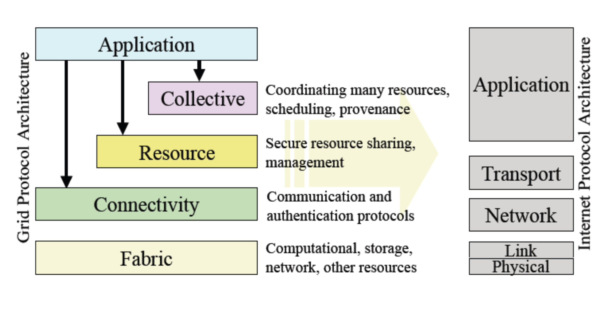
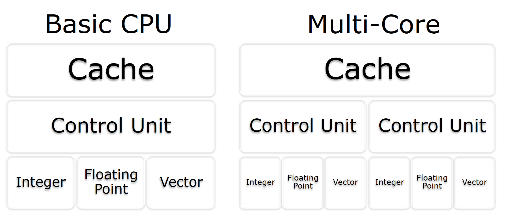
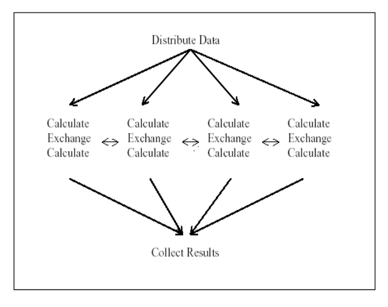
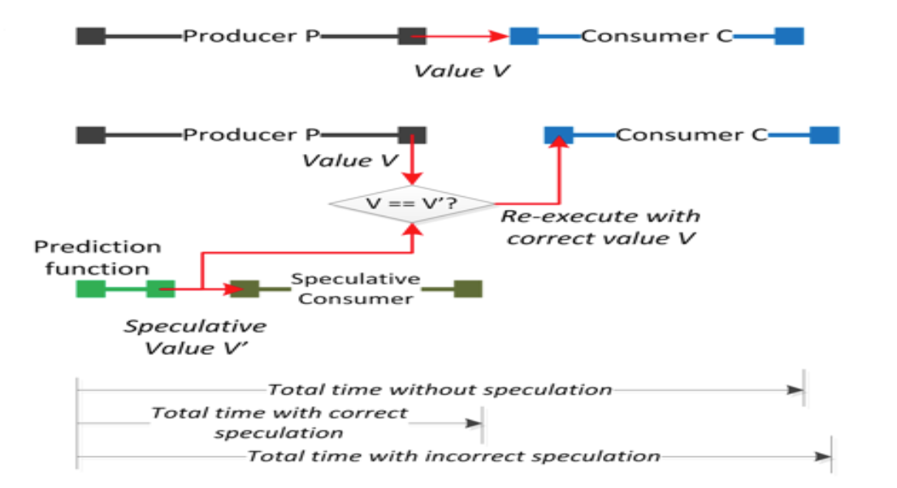
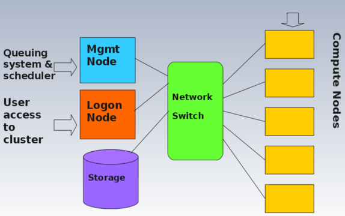
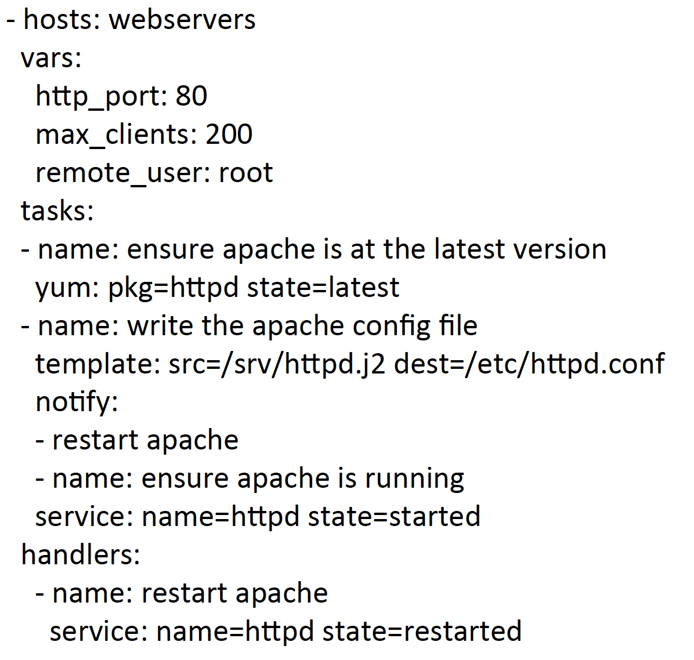
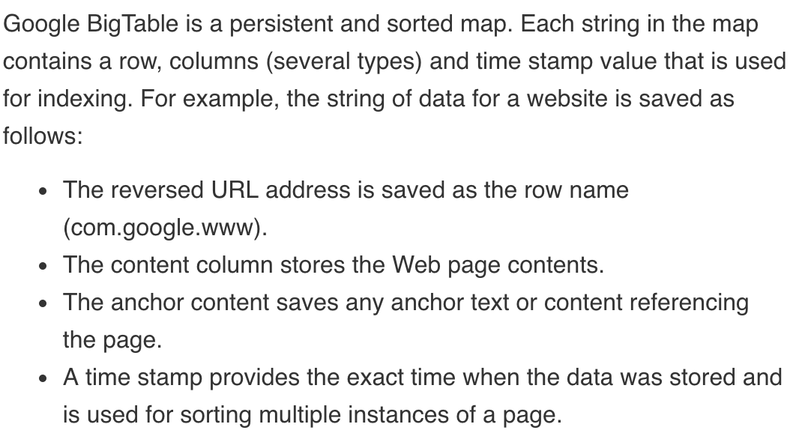
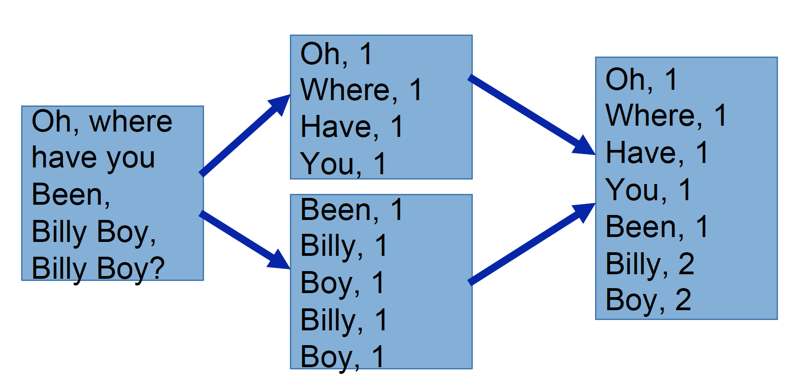
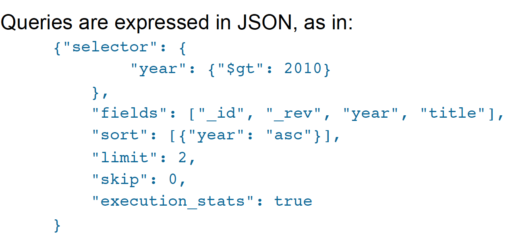
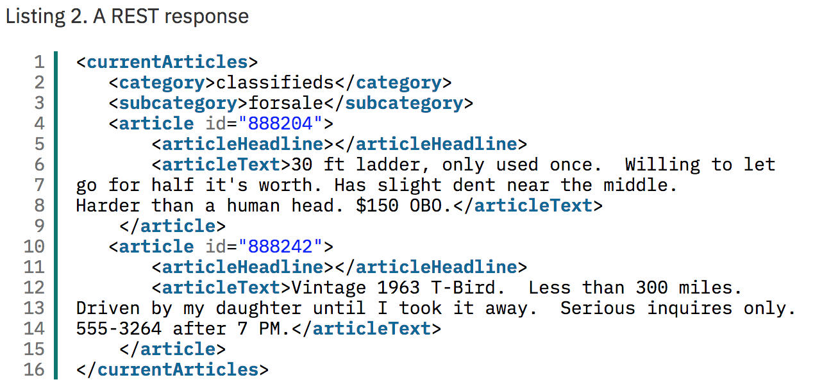

# Cluster and Cloud Computing

## Contents

- [Lecture 1](#lecture-1)
- [Lecture 3](#lecture-3)
- [Lecture 4](#lecture-4)
- [Lecture 5](#lecture-5)
- [Lecture 6](#lecture-6)
- [Lecture 7](#lecture-7)

---

## Lecture 1

**Computing and Communication Technologies (r)evolution: 1960-:**


- **Centralised system:** Single physical (centralised) system. All resources (processors, memory and storage) fully shared and tightly coupled within one integrated OS
- **Parallel system:** All processors (_each processor in all the processors_)either tightly coupled with centralised shared memory or loosely coupled with _distributed memory_(refer to pictures below). Interprocess communication through shared memory or throughsome form of message passing


- **Distributed system:** Multiple autonomous computers with their own private memory, communicating through some form of message passing over a computer network
- **Cloud computing:** It is distributed computing over a network and has the ability to run a program on many connected computers at the same time.

**Cloud Characteristics:**

- _On-demand self-service_: A consumer can provision computing capabilities as needed without requiring human interaction with each service provider.
- _Networked access_: Capabilities are available over the network and accessed through standard mechanisms that promote use by heterogeneous client platforms.
- _Resource pooling_: The provider's computing resources are pooled to serve multiple consumers using a multi-tenant model potentially with different physical and virtual resources that can be dynamically assigned and reassigned according to consumer demand.
- _Rapid elasticity_: Capabilities can be elastically provisioned and released, in some cases automatically, to scale rapidly upon demand.
- _Measured service_: Cloud systems automatically control and optimize resource use by leveraging a metering capability at some level of abstraction appropriate to the type of service.

**Grid Architecture:**


## Lecture 3

**Compute Scaling:**

- _Vertical Computational Scaling_ (quality,improving performance of processors): Have faster processors, Limits of fundamental physics/matter (nanoCMOS)
- _Horizontal Computational Scaling_(quantity of processors): Have more processors (Easy to add more, cost increase not so great,but harder to design, develop, test, debug, deploy, manage, understand)

**ADD MORE:**

- Single machine multiple cores
- Loosely coupled cluster of machines (Pooling/sharing of resources)
- Tightly coupled cluster of machines (Typical HPC/HTC set-up,SPARTAN)
- Widely distributed clusters of machines
- Hybrid combinations of the above


- **T(1)** = time for serial computation
- **T(N)** = time for N parallel computations
- **S(N)** = speed up
- Proportion of speed up depends on parts of program that can’t be parallelised

**Amdahl's Law:**


- If 95% of the program can be parallelized, the theoretical maximum speedup using parallel computing would be 20×, no matter how many processors are used
- If the non-parallelisable part takes 1 hour, then no matter how many cores you throw at it it won’t complete in <1 hour.

****Overheads:** overhead is any combination of excess or indirect computation time, memory, bandwidth, or other resources that are required to perform a specific task (It's like when you need to go somewhere, you might need a car. But, it would be a lot of overhead to get a car to drive down the street, so you might want to walk. However, the overhead would be worth it if you were going across the country.)


**Gustafson-Barsis's Law:** programmers tend to set the size of problems to use the available equipment to solve problems within a practical fixed time. _Faster (more parallel) equipment available, larger problems can be solved in the same time_

**Computer Architecture:**

- CPU for executing programs
- Memory that stores/executing programs and related data
- I/O systems (keyboards, networks, …)
- Permanent storage for read/writing data into out of memory(hard disk)
- Balance of all of these
- different ways to design/architect computers


### Approaches for Parallelism
**Explicit vs Implicit Parallelisation:**

- _Implicit Parallelism_: Supported by parallel languages and parallelizing compilers that take care of identifying parallelism, the scheduling of calculations and the placement of data
- _Explicit Parallelism_:the programmer is responsible for most of the parallelization effort such as task decomposition, mapping tasks to processors, inter-process communications

**Hardware Parallelisation:**


- Cache: much faster than reading/writing to main memory,instruction cache, data cache (multilevel) and translation lookaside buffer used for virtual-physical address translation

Parallelisation by adding extra CPU to allow more instructions to be processed per cycle.


Multiple cores that can process data and perform computational tasks in parallel(L1 cache on single cores; L2 cache on pairs of cores; L3 cache
shared by all cores, (higher hit rates
but potentially higher latency))


Two (or more) identical processors connected to a single, shared main memory, with full access to all I/O devices, controlled by a single OS instance that treats all processors equally. Each processor executes different programs and works on different data but with capability of sharing common resources (memory, I/O device, …). Processors can be connected in a variety of ways: buses, crossbar switches, meshes. More complex to program since need to program both for CPU and inter-processor communication (bus).


**Non-uniform memory access (NUMA)** provides speed-up by allowing a processor to access its own local memory faster than non-local memory. Improved performance as long as data are localized to specific processes/processors. Key is allocating memory/processors to avoid scheduling/locking and (expensive) inter-processor communication

**OS Parallelism:**

- parallel(real parallel) vs interleaved semantics(context switch)
- Compute parallelism (Native threads, Fork, Spawn, Join; Green threads Scheduled by a virtual machine instead of natively by the OS)
- Data parallelism(Caching)

**Software Parallelism:**

- Deadlock – processes involved constantly waiting for each other
- Livelock – processes involved in livelock constantly change with regard to one another, but none are progressing

**Message Passing Interface:**(message passing in parallel
systems)


Data Parallelism


**Distribution system challenges:** A distributed system is one in which the failure of a computer you didn't even know existed can render your own computer unusable (**Assumptions)

****Bandwidth:** Bandwidth is the capacity of a wired or wireless network communications link to transmit the maximum amount of data from one point to another over a computer network or internet connection in a given amount of time -- usually one second.

****Topology:** A network topology is the arrangement of a network, including its nodes and connecting lines. There are two ways of defining network geometry: the physical topology and the logical (or signal) topology.

- physical topology: the actual geometric layout of workstations(star or ring network)
- some networks are physically laid out in a star configuration, but they operate logically as bus or ring networks

**Incorrected Assumptions in distributed system:**

```
1. The network is reliable
2. Latency is zero
3. Bandwidth is infinite
4. The network is secure
5. Topoogy doesn't change
6. There is one administrator
7. Transport cost is zero
8. The network is homogeneous
9. Time is ubiquitous
```

**Design Stages of Parallel Programs:**(through steps)

1. Partitioning: Decomposition of _computational activities(procedures) and data_ into smaller tasks(Master-worker,pipeline, divide and conquer)
2. Communication: Flow of information and coordination among tasks that are created in the partitioning stage
3. Agglomeration(collection of things):
    - Tasks and communication structure created in the above stages are evaluated for performance and implementation cost
    - Tasks may be grouped into larger tasks to improve communication
    - Individual communications can be bundled
4. Mapping / Scheduling: Assigning tasks to processors such that job completion time is minimized and resource utilization is maximized

**Master-Slave model:** Master decomposes the problem into small tasks(different processes), distributes to workers and gathers partial results to produce the final result


**Single-Program Multiple-Data:**

- Each process executes the same piece of code, but on different parts of the data
- Data is typically split among the available processors



**Data Pipelining:** Suitable for applications involving multiple stages of execution, that typically operate on large number of data sets.


**Divide and Conquer:**

- A problem is divided into two or more sub problems, and each of these sub problems are solved independently, and their results are combined
- 3 operations: split, compute, and join
- Master-slave is like divide and conquer with master doing both split and join operation


**Speculative Parallelism:**(Used when it is quite difficult to achieve parallelism through the previous paradigms)

- Problems with complex dependencies - use “look ahead “execution
- If the value of V is predictable, we can execute C speculatively using a predicted value in parallel with P.

    - If the prediction turns out to be correct, we gain performance since C doesn’t wait for P anymore.
    - If the prediction is incorrect (which we can find out when P completes), we have to take corrective action, cancel C and restart C with the right value of V again



## Lecture 4

**Supercomputer:** any single computer system (itself a contested term) that has exceptional processing power for its time.

**High-performance computing (HPC):** any computer system whose architecture allows for above average performance. A system that is one of the most powerful in the world, but is poorly designed, could be a "supercomputer". _High-performance computing (HPC) is the use of super computers and parallel processing techniques for solving complex computational problems. A highly efficient HPC system requires a high-bandwidth, low-latency network to connect multiple nodes and clusters._

**Clustered computing:**

- Clustered computing is when two or more computers serve a single resource
- This improves performance and provides redundancy in case of failure system
- For example, there are a collection of smaller computers strapped together with a high-speed local network, although a low-speed network system could certainly be used.

****The clustered HPC is the most efficient, economical, and scalable method, and for that reason it dominates supercomputing today.**

**Cluster and Parellel:** With a cluster architecture, applications can be more easily parallelised across them. Parallel computing refers to the submission of jobs or processes over multiple processors and by splitting up the data or tasks between them._The core issue is that high performance compute clusters is just speed and power but also usage, productivity, correctness, and reproducibility_

**HPC Cluster Design:**


**Degree of parallelisation by using Flynn's Taxonomy of Computer
Systems:** each process is considered as the execution of a pool of instructions (instruction stream) on a pool of data (data stream)


**Limitations of Parallel Computation:** Parallel programming and multicore systems should mean better performance

- Speedup (p) = Time (serial)/ Time (parallel)
- Correctness in parallelisation requires synchronisation (locking). Synchronisation and atomic operations causes loss of performance, communication latency.
- Amdahl's law, establishes the maximum improvement to a system when only part of the system has been improved. Gustafson and Barsis noted that Amadahl's Law assumed a computation problem of fixed data set size.

**Shared Memory Parallel Programming:** 

- multithreading programming, whereby a master thread forks a number of sub-threads and divides tasks between them. The threads will then run concurrently and are then joined at a subsequent point to resume normal serial application.
- One implementation of multithreading is OpenMP (Open Multi-Processing). It is an Application Program Interface that includes directives for multi-threaded, shared memory parallel programming.
- However, OpenMP is limited to a single system unit (no distributed memory) and is thread-based rather than using message passing.


**Distributed Memory Parallel Programming:** MPI (Message Passing
Interface), along with implementation as OpenMPI. It leads to connecting several systems together to form clusters of computers to work together to solve a single computational workload.

- The core principle is that many processors should be able cooperate to solve a problem by passing messages to each through a common communications network
- However, it requires explicit programmer effort, The programmer is responsible for identifying opportunities for parallelism and implementing algorithms for parallelisation using MPI

**MPI Communication (Game):**  A very popular and basic use of MPI Send and Recv routines is a ping-ping program. Because it can be used to test latency within and between nodes and partitions if they have different interconnect (like on Spartan).

- **routines** here which manage the communication in the ping-pong activity

    - MPI_Status()
    - MPI_Request()
    - MPI_Barrier()
    - MPI_Wtime()

## Lecture 5

### NIST definition: “Cloud computing is a model for enabling ubiquitous, convenient, on-demand network access to a shared pool of configurable computing resources (e.g., networks, servers, storage, applications, and services) that can be rapidly provisioned and released with minimal management effort or service provider interaction.”

**The Most Common Cloud Models:**


### Deployment Models

**Public Clouds:** Public clouds are the most common way of deploying cloud computing. The cloud resources (like servers and storage) are owned and operated by a third-party cloud service provider and delivered over the Internet. With a public cloud, all hardware, software and other supporting infrastructure are owned and managed by the cloud provider. In a public cloud, you share the same hardware, storage and network devices with other organisations or cloud “tenants”. You access services and manage your account using a web browser. Public cloud deployments are frequently used to provide web-based email, online office applications, storage, and testing and development environments

- Pros
    - Utilty computing
    - Can focus on core business
    - Cost-effective
    - “Right-sizing”
    - Democratisation of computing
- Cons
    - Security
    - Loss of control
    - Possible lock-in
    - Dependency of Cloud provider continued existence

**Private Clouds:** A private cloud consists of computing resources used exclusively by one business or organisation. The private cloud can be physically located at your organisation’s on-site data centre, or it can be hosted by a third-party service provider. But in a private cloud, the services and infrastructure are always maintained on a private network and the hardware and software are dedicated solely to your organisation. In this way, a private cloud can make it easier for an organisation to customise its resources to meet specific IT requirements. Private clouds are often used by government agencies, financial institutions and any other medium to large-sized organisations with business-critical operations seeking enhanced control over their environment.

- Pros
    - Control
    - Consolidation of resources
    - Easier to secure
    - More trust
- Cons
    - Relevance to core business? e.g. Netflix moved to Amazon
    - Staff/management overheads
    - Hardware obsolescence(outdated and no longer used)
    - Over/under utilisation challenges

**Hybrid Clouds:** In a hybrid cloud, data and applications can move between private and public clouds for greater flexibility and more deployment options. For instance, you can use the public cloud for high-volume, lower-security needs such as web-based email, and the private cloud (or other on-premises infrastructure) for sensitive, business-critical operations like financial reporting. In a hybrid cloud, “cloud bursting” is also an option. This is when an application or resource runs in the private cloud until there is a spike in demand (such as a seasonal event like online shopping or tax filing), at which point the organisation can “burst through” to the public cloud to tap into additional computing resources

- Pros
    - Cloud-bursting, Use private cloud, but burst into public cloud when needed
- Cons
    - How do you move data/resources when needed?
    - How to decide (in real time?) what data can go to public cloud?
    - Is the public cloud compliant with PCI-DSS (Payment Card Industry – Data Security Standard)?

### Delivery Models


**Infrastructure as a service (IaaS):**

- Infrastructure as a service (IaaS) is an instant computing infrastructure, provisioned and managed over the Internet. Quickly scale up and down with demand, and only pay for what you use.
- IaaS helps you avoid the expense and complexity of buying and managing your own physical servers and other data centre infrastructure. Each resource is offered as a separate service component, and you only need to rent a particular one for as long as you need it. The cloud computing service provider manages the infrastructure, while you purchase, install, configure and manage your own software – operating systems, middleware and applications.
- For example, Website hosting, High-performance computing,Big data analysis

**Platform as a service (PaaS):**

- PaaS allows you to avoid the expense and complexity of buying and managing software licences, the underlying application infrastructure and middleware or the development tools and other resources. You manage the applications and services that you develop, and the cloud service provider typically manages everything else.
- For example, PaaS provides a framework that developers can build upon to develop or customise cloud-based applications.It has pre-coded application components built into the platform, such as workflow, directory services, security features, search and so on

**Software as a service (SaaS):**

- Software as a service (SaaS) allows users to connect to and use cloud-based apps over the Internet. Common examples are email(web-based email service such as Outlook, Hotmail or Yahoo! Mail), calendaring and office tools (such as Microsoft Office 365).
- SaaS provides a complete software solution that you purchase on a pay-as-you-go basis from a cloud service provider. You rent the use of an app for your organisation, and your users connect to it over the Internet, usually with a web browser. All of the underlying infrastructure, middleware, app software and app data are located in the service provider’s data centre. The service provider manages the hardware and software, and with the appropriate service agreement, will ensure the availability and the security of the app and your data as well. SaaS allows your organisation to get up and running quickly with an app, at minimal upfront cost.


****OpenStack** is a cloud operating system that controls large pools of compute, storage, and networking resources throughout a datacenter, all managed through a dashboard that gives administrators control while empowering their users to provision resources through a web interface. It makes horizontal scaling easy, which means that tasks that benefit from running concurrently can easily serve more or fewer users on the fly by just spinning up more instances.

**Automation:** ??

**Classification of Scripting tools:**

- Cloud-focused, Only used to interact with Cloud services
    - Apache JClouds (Java-based - supports mulBple clouds)
    - Boto (Python – supports AWS and OpenStack)
    - OpenStackClient (Python - supports OpenStack)
    - CloudFormaBon (YAML/JSON - supports AWS, OpenStack Heat)
- Shell scripts
    - Bash
    - Perl
- Configuration management (CM) tools, refers to the process of systematically handling changes to a system in a way that it maintains integrity over time. Automation is the mechanism used to make servers reach a desirable state.
    - Chef (uses Ruby for creaBng cookbooks)
    - Puppet (uses its own configuraBon language)
    - Ansible (use YAML to express playbooks)
    - Fabric (Python library that uses SSH for applicaBon deployment and administraBon tasks)
    - Terraform, SaltStack, Docker, …


**Ansible:** Automation should not be more complex than the task(For example, to update thousands of instances)

- Ansible is a radically simple IT automation engine that automates cloud provisioning, configuration management, application deployment, intra-service orchestration, and many other IT needs.

****Playbooks** are Ansible’s configuration, deployment, and orchestration language.Playbooks are designed to be human-readable and are developed in a basic text language

#### Ansible: Structure

- Ansible scripts are called playbooks
- Scripts writen as simple YAML files
- Structured in a simple folder hierarchy


#### Ansible: Inventory

- Description of the nodes that can be accessed by Ansible
- By default, stored in .INI file
- Can be groupe

```
[webservers]
foo.example.com
bar.example.com

[dbservers]
one.example.com
two.example.com
three.example.com
```

#### Ansible: Playbooks

- Executed sequentially from a YAML file


#### Ansible: Features

- Easy to learn
    - Playbooks in YAML, Templates in Jinja2, Inventory in .INI file
    - SequenBal execuBon
- Minimal requirements
    - No need for centralized management servers/daemons
    - Single command to install (pip install ansible)
    - Uses SSH to connect to target machine
- Idempotent (repeatable):
    - Executing N times no different to executing once
    - Prevents side-effects from re-running scripts
- Extensible:
    - Write your own modules
- Supports push or pull
    - Push by default but can use cron job to make it pull
- Rolling updates
    - Useful for continuous deployment/zero downtime deployment
- Inventory management
    - Dynamic inventory from external data sources
    - Execute tasks against host patterns
- Ansible Vault for encrypted data
- Ad-hoc commands
    - When you need to execute a one-off command against your inventory
        - e.g. ansible -i inventory_file -u ubuntu -m shell -a “reboot”
- Ansible Tower: Enterprise mission control for Ansible 
    - (Dashboard, System Tracker, etc)

## Lecture 6

### “Big data” Challenges and Architectures

**The four “Vs” :**

- Volume, (Giga, Tera, Peta)
- Velocity, how fast new data being brought in to the system and analysis performed
- Variety: the variability and complexity of data schema(number of types of data). The more complex the data schema(s) you have, the higher the probability of them changing along the way, adding more complexity.
- Veracity: the level of trust in the data accuracy (provenance); the more diverse sources you have, the more unstructured they are, the less veracity you have.

**Why DBMSs(database management system) for Distributed Environments:**

- Relational DBMSs rely on normalized data models to ensure consistency
- It makes sense to use DBMSs that are built upon data models that are not relational (tables and relationships amongst tables and the entities they describe)

**DBMSs for Distributed Environments:**

- A _key-value store_ is a DBMS that allows the retrieval of a chunk of data given a key: fast, but crude (e.g. Redis, PostgreSQL Hstore, Berkeley DB)
- A _BigTable_ DBMS stores data in columns grouped into column families, with rows potentially containing different columns of the same family (e.g. Google BigTable, Apache Accumulo)



- A _Document-oriented_ DBMS stores data as structured documents, usually expressed as XML or JSON (e.g. Apache CouchDB, MongoDB)

**The Tale of Two Clusters:**(1. spread over loads and horizontal scability  2. redunancy->one machine failed is not the end of word)

- Distributed databases are run over “clusters”, that is, sets of connected computers
- Clusters are needed to:
    - Distribute the computing load over multiple computers, e.g. to improve availability
    - Storing multiple copies of data, e.g. to achieve redundancy
- Consider two document-oriented DBMSs (CouchDB and MongoDB) and their typical cluster architectures

#### MongoDB Cluster Architecture


```
****MongoDB replica set and shard:**

- **replica set**
    - MongoDB replication stores multiple copies of data across different databases in multiple locations, and thus protects data when the database suffers any loss, increasesing data availability by creating data redundancy.
    - A replica set consists of a group of mongod (read as Mongo D) instances that host the same data set.(That is Node A.* in the picture above)
    - In a replica set, the primary mongod receives all write operations and the secondary mongod replicates the operations from the primary and thus both have the same data set. The primary node receives write operations from clients.
    - A replica set can have only one primary and therefore only one member of the replica set can receive write operations
    - When the primary becomes unavailable, the replica set nominates a secondary as the primary
    - Secondary members in a replica set asynchronously apply operations from the primary
- **shard** 
    - Sharding in MongoDB is the process of distributing data across multiple servers for storage. With an increase in the data size, a single machine may not be able to store data or provide an acceptable read and write throughput. MongoDB sharding supports horizontal scaling and thus is capable of distributing data across multiple machines
    - Each shard serves as an independent database, and together, shards make a single logical database. MongoDB sharding reduces the number of operations each shard handles and as a cluster grows, each shard handles fewer operations and stores lesser data. As a result, a cluster can increase its capacity and input horizontally.
    - A shard is a replica set or a single mongod instance that holds the data subset used in a sharded cluster. Shards hold the entire data set for a cluster. Each shard is a replica set that provides redundancy and high availability for the data it holds
- **features of arbiters**
    - They DO NOT maintain a dataset
    -  Their primary function is to select the primary node
    - They do not store data and hence need no additional hardware
```

- Sharding is done at the replica set level, hence it involves more than one cluster (a shard is on top of a replica set)
- Only the primary node in a replica set answers write requests, but read requests can -depending on the specifics of the configuration- be answered by every node (including secondary nodes) in the set
- Updates flow only from the primary to the secondary
- If a primary node fails, or discovers it is connected to a minority of nodes, a secondary of the same replica set is elected as the primary
- Arbiters (MongoDB instances without data) can assist in breaking a tie in elections.
- Data are balanced across replica sets
- Since a quorum has to be reached, it is better to have an odd number of voting members (the arbiter in this diagram is only illustrative)

#### CouchDB Cluster Architecture


- All nodes answer requests (read or write) at the same time
- When a node does not contain a document (say, a document of Shard A is requested to Node 2), the node requests it from another node (say, Node 1)and returns it to the client
- Nodes can be added/removed easily, and their shards are re-balanced automatically upon addition/deletion of nodes
- In this example there are 3 nodes, 4 shards and a replica number of 2

#### MongoDB vs CouchDB Clusters

- MongoDB clusters are considerably more complex than CouchDB ones
- MongoDB clusters are less available, as - by default - only primary nodes can talk to clients for read operations, (and exclusively so for write operations)
- MongoDB software routers (MongoS) must be embedded in application servers, while any HTTP client can connect to CouchDB
- Some features (such as unique indexes or geo-spatial indexes) are not supported in MongoDB sharded environments
- Losing two nodes out of three in the CouchDB example architecture,means losing access to one quarter of data, while losing two nodes in the MongoDB example architecture implies losing access to half the data (although there are ten nodes in the cluster instead of three)

#### Brewer’s CAP Theorem

- Consistency: every client receiving an answer receives _the same answer_ from all nodes in the cluster
- Availability: every client receives _an answer_ from any node in the cluster
- Partition-tolerance: the cluster _keeps on operating_ when one or more nodes cannot communicate with the rest of the cluster

**pick any two...

#### CAP Theorem and the Classification of Distributed Processing Algorithms


##### Consistency and Availability: Two phase commit

```
**As its name implies, the coordinator arranges activities and synchronization between distributed servers. Saving data changes is known as a commit and undoing changes is known as a rollback. The two-phase commit is implemented as follows:

- **Phase 1 - Each server that needs to commit data writes its data records to the log. If a server is unsuccessful, it responds with a failure message. If successful, the server replies with an OK message.

- **Phase 2 - This phase begins after all participants respond OK. Then, the coordinator sends a signal to each server with commit instructions. After committing, each writes the commit as part of its log record for reference and sends the coordinator a message that its commit has been successfully implemented. If a server fails, the coordinator sends instructions to all servers to roll back the transaction. After the servers roll back, each sends feedback that this has been completed.
```

- it enforces consistency by:
    - locking data that are within the transaction scope
    - performing transactions on write-ahead logs
    - completing transactions (commit) only when all nodes in the cluster have performed the transaction
    - aborts transactions (rollback) when a partition is detected
- procedure entails:
    - reduced availability (data lock, stop in case of partition)
    - enforced consistency (every database is in a consistent state, and all are left in the same state)

Therefore, two-phase commit is a good solution when the cluster is co-located, less then good when it is distributed

##### Consistency and Partition-Tolerance: Paxos

```
**Basic steps in Paxos:

- Elect a node to be a Leader / Proposer
- The Leader selects a value and sends it to all nodes (called Acceptors in Paxos) in an accept-request message. Acceptors can reply with reject or accept.
- Once a majority of the nodes have accepted, consensus is reached and the coordinator broadcasts a commit message to all nodes.
```

- driven by consensus, and is both partitiontolerant and consistent
- In Paxos, every node is either a proposer or an accepter :
    - a proposer proposes a value (with a timestamp)
    - an accepter can accept or refuse it (e.g. if the accepter receives a more recent value)
- when a proposer has received a sufficient number of acceptances (a quorum is reached), and a confirmation message is sent to the accepters with the agreed value
- Paxos clusters can recover from partitions and maintain consistency, but the smaller part of a partition (the part that is not in the quorum) will not send responses, hence the availability is compromised

##### Availability and Partition-tolerance: Multi-Version Concurrency Control (MVCC)

```
Multiversion Concurrency Control (MVCC) enables snapshot isolation. Snapshot isolation means that whenever a transaction would take a read lock on a page, it makes a copy of the page instead, and then performs its operations on that copied page. This frees other writers from blocking due to a read locks held by other transactions.

```

- MVCC is a method to ensure availability (every node in a cluster always accepts requests), and some sort of recovery from a partition by reconciling the single databases with revisions (data are not replaced, they are just given a new revision number)
- In MVCC, concurrent updates are possible without distributed locks (in optimistic locking only the local copy of the object is locked), since the updates will have different revision numbers; the transaction that completes last will get a higher revision number, hence will be considered as the current value.
- In case of cluster partition and concurrent requests with the same revision number going to two partitioned nodes, both are accepted, but once the partition is solved, there would be a conflict. Conflict that would have to be solved somehow (CouchDB returns a list of all current conflicts, which are then left to be solved by the application).
- MVCC relies on monotonically increasing revision numbers and, crucially, the preservation of old object versions to ensure availability (i.e. when an object is updated, the old versions can still be read).

#### Document-oriented DBMS for Big data

Relational DBMSs(fine-grained data)---->>ensuring consistency and availability using normalization but less partition-tolerant than coarse-grained data

- Relational data model, including a person table, a telephone table, an email table
- Document-oriented database, one document type only, with telephones numbers, email addresses, etc., nested as arrays in the same document

#### MongoDB vs CouchDB Clusters

- While CouchDB uses MVCC, MongoDB uses a hybrid two-phase commit (for replicating data from primary to secondary nodes) and Paxos-like in supporting network partition strategies
- MongoDB, a network partition may segregate a primary into a partition with a minority of nodes. When the primary detects that it can only see a minority of nodes in the replica set, the primary steps down and becomes a secondary. Independently, a member in the partition that can communicate with a majority of the nodes (including itself) holds an election to become the new primary.

#### Sharding

- Sharding is the partitioning of a database “horizontally”, i.e. the database rows (or documents) are partitioned into subsets that are stored on different servers. Every subset of rows is called a shard.
- Usually the number of shards is larger than the number of _replicas(number of copies of single data)_, and the number of nodes is larger than the replica number(A replica set contains several data bearing nodes and optionally one arbiter node, nodes including primary node and secondary and arbiter node)
- Main advantage of a sharded database,  improvement of performance through the distribution of computing load across nodes and easier to move data files around, e.g. when adding new nodes to the cluster
- different sharding strategies:
  - _Hash sharding_: to distribute rows evenly across the cluster
  - _Range sharding_: similar rows (say, tweets coming for the same area) that are stored on the same node (or subset of nodes)


---


#### Replication and Sharding

- Replication is the action of storing the same row (or document) on different nodes to make the database fault-tolerant.
- Replication and sharding can be combined with the objective of _maximizing availability while maintaining a minimum level of data safety(any failure)_.

### MapReduce Algorithms

- Particularly suited to parallel computing of the Single-Instruction, Multiple-Data type
- [The first step (Map), distributes data across machines(machine for map, distributed load to clusers/computers), while the second (Reduce) hierarchically summarizes them until the result is obtained.](https://www.quora.com/How-does-Map-Reduce-exactly-work-And-what-functions-run-on-which-machines-architecturally)
- Apart from parallelism, its advantage lies in _moving the process to where data are_, greatly reducing network traffic.
- it is horizontally scalable



****More specific**


### Introduction to CouchDB

#### CouchDB Main Features

- Document-oriented DBMS, where documents are expressed in JavaScript Object Notation (JSON)
- HTTP ReST API
- Web-based admin interface
- Web-ready: since it talks HTTP and produces JSON (it can also produce HTML or XML), it can be both the data and logic tier of a three-tier application, hence avoiding the marshaling and unmarshaling of data objects
- Support for MapReduce algorithms, including aggregation at different levels
- avaScript as the default data manipulation language
- Run Mango queries (MongoDB query language), which can use indexes for better performance
- Schema-less data model with JSON as the data definition language
- Support for replication
- Support for sharding
- Support for clustering

##### Database

- A CouchDB instance can have many databases; each database can have its own set of functions, and can be stored in different shards
- In every CouchDB instance there are system databases. These are prefixed by underscore, such as _users

##### Querying a CouchDB Databas

Two mechanisms to select a set of _documents (json structure, including multiple types of data)_ that exhibit certain features

- MapReduce Views: results of MapReduce processes that are written as B-tree indexes to disk and become part of the database. Views are fast, but inflexible and use a lot of storage. Views are used for a number of reasons, including:

```
    - Indexing and querying data from stored objects
    - Producing lists of data on specific object types
    - Producing tables and lists of information based on your stored data
    - Extracting or filtering information from the database
    - Calculating, summarizing or reducing the information on a collection of stored data
```

- Mango Queries: queries expressed in JSON, following the MongoDB queries syntax (Mango queries can also use B-tree indexes to speed-up computations)(For example, Json will retrieves all the indexes from the database)



- Mango Indexes,to speed-up queries, Mango can use B-tree indexes on attributes


##### Views

- views are not influenced by the state of the system
    - defined in languages other than JavaScript
    - cannot be passed custom parameters, either during computation or during selection
    - Computation of views can be influenced only by the document itself
- this ensures consistency of results

##### List and Show Functions

Views are limited, since they can produce only JSON and cannot
change their behavior. To address these shortcomings, CouchDB offers List and Show functions

- Both these two classes of functions can modify their behavior when HTTP request parameters are sent, and both can produce non-JSON output
- List functions transform a view into a list of something (can be a list of HTML ```<li>``` tags, or a list of ```<doc>``` XML tags.
- Show functions transform an entire document into something else (like an entire HTML page).
- To sum up:
    - Show functions are applied to the output of a single document query
    - List functions are applied to the output of Views
    - List and Show functions can be seen as the equivalent of JEE servlets


## Lecture 7

### Introduction to SOA (Service-oriented architecture)

**What's in an Architecture?**

- A system architecture is the way different software components are distributed on computing devices, and the way in which they interact with each other
- standard graphic way, UML deployment diagram, which is diagrams used to describe the physical components (hardware), their distribution, and association.

```
**Service-Oriented Architecture: A service-oriented architecture is a style of software design where services are provided to the other components by application components, through a communication protocol over a network. The basic principles of service-oriented architecture are independent of vendors, products and technologies.[1] A service is a discrete unit of functionality(independent functionality) that can be accessed remotely and acted upon and updated independently, such as retrieving a credit card statement online.

A service has four properties from SOA:
- It logically represents a business activity with a specified outcome.
- It is self-contained.
- It is a black box for its consumers.
- It may consist of other underlying services.

Different services can be used in conjunction to provide the functionality of a large software application. Service-oriented architecture is less about how to modularize an application, and more about how to compose an application by integrating distributed, separately-maintained and deployed software components. It is enabled by technologies and standards that make it easier for components to communicate and cooperate over a network, especially an IP network.

```


**Why SOA?**

- When an architecture is completely contained within the same machine, components communicate through function calls or object instantiations. However, when components are distributed, function calls and object instantiations cannot always be used directly.
- Services are often used for this._Every system in a SOA should be considered as autonomous, but network-reachable and inter-operable through services._

**SOA Core Ideas:**

- _A set of services_ that a business wants to provide to their customers, partners, or other areas of an organization
- An architectural pattern that requires a service provider, mediation, and service requestor with a service description
- _A set of architectural principles, patterns and criteria_ that address characteristics such as modularity, encapsulation, loose coupling, separation of concerns, reuse and composability
- _A programming model_ complete with standards, tools and technologies that supports web services, ReST services or other kinds of services
- _A middleware solution_ optimized for service assembly, orchestration, monitoring, and management

**SOA Principles:**

- Standardized service contract: Services adhere to a communications agreement, as defined collectively by one or more service-description documents.
- Service loose coupling: Services maintain a relationship that minimizes dependencies and only requires that they maintain an awareness of each other.
- Service abstraction: Beyond descriptions in the service contract, services hide logic from the outside world.
- Service reusability: Logic is divided into services with the intention of promoting reuse.
- Service autonomy: Services have control over the logic they encapsulate.
- Service statelessness: Services minimize resource consumption by deferring the management of state information when necessary.
- Service discoverability: Services are supplemented with communicative meta data by which they can be effectively discovered and interpreted.
- Service composability: Services are effective composition participants, regardless of the size and complexity of the composition
- Service granularity: A design consideration to provide optimal scope at the right granular level of the business functionality in a service operation.
- Service normalization: Services are decomposed and/or consolidated to a level of normal form to minimize redundancy. In some cases, services are denormalized for specific purposes, such as performance optimization, access, and aggregation.
- Service location transparency: The ability of a service consumer to invoke a service regardless of its actual location in the network.

**SOA for the Web:** (Web services can implement a service-oriented architecture)

- Two main flavors
    - ReSTful Web Services
    - SOAP/WS
- Both uses HTTP, hence can run over the web (although SOAP/ WS can run over other protocols as well)
- They are by far the most used (especially ReST) but not the only ones:
    - Geospatial services
    - Health services
    - SDMX

```
RESTful is architectural style  and SOAP is protocol, both are used to access web services. Web services as the exchange of SOAP-based messages between systems and REST is a type of web service in which the user simply accesses a URL, and the response is a straight XML document

SOAP provides the envelope for sending Web Services messages over the Internet/Internet. SOAP use XML (Extensible Markup Language) over HTTP as the intermediate language for exchanging data between applications.
(https://www.guru99.com/soap-simple-object-access-protocol.html)

These SOAP messages move from one system to another, usually via HTTP. The receiving system interprets the message, does what it's supposed to do, and sends back a response in the form of another SOAP message.

Universal Resource Identifiers (URI) in REST and are used through the header operations of HTTP. HTTP is the protocol used in REST. The HTTP requests are used in order to read and write data. The four methods which are GET, PUT, POST and DELETE are used in REST based web services. Therefore, the HTTP protocol is used by REST in order to perform the four operations which are create, read, update and delete (CRUD). In order to interact with the resource the standard methods of HTTP are used. The use of different methods present in HTTP protocol are used for the following purpose; GET method is used to retrieve the required resource, POST method is used to create the resource successfully, in order to update the resource PUT method is used and to remove the resource that is no more required can be removed using the method known as DELETE. 


```




#### SOAP/WS vs ReST

- Two different architectural design to call services over HTTP
- SOAP/WS is built upon the paradigm of the Remote Procedure Call; practically, a language independent function call that spans another system
- ReST is centered around resources, and the way they can be manipulated (added, deleted, etc.) remotely
- ReST is more of a style of using HTTP than a separate protocol, while SOAP/WS is a stack of protocols that covers every aspect of using a remote service, from service discovery, to service description, to the actual request/response
- ReST makes use of the different HTTP Methods (GET, POST, PUT, DELETE, etc)


##### SOAP

```
**UDDI: The idea was to provide a way for companies to register their 
services in a global registry, and search that global registry for 
services they may be interested in using
```

- UDDI: The Uniform Description Discovery and Integration is a protocol to access a registry of services
- WS-* (web service specifications on top of others) Refers to additional attendant standards for SOAP web services


- These extensions(UDDI and WS-*) go in the SOAP headers for additional functionality
- WSDL: The _Web Services Description Language_ is an XML based interface description language that is used for describing the functionality offered by a web service.
- WSDL provides a machine-readable description of how the service can be called, what parameters it expects, and what data structures it returns. (NOTE: WSDL defines ports, but these are service ports -endpoints- not to be confused with HTTP ports -which are numbers.)

### The OGC Stack

The OpenGIS Consortium (OGC) is a non-profit group of organizations (companies, universities, state agencies, etc.) that share the common goal of defining standards for all things geo-spatial,e.g data with geographic information. It defined a set of standards that _define a family of SOAPbased web-services to support access to geo-spatial data_

OGC web-services cover different ways of interacting with geo-spatial data:

- Finished maps (as the ones you see on Google Maps)
- Vector data (just the geometry, in practice a collection of points)
- Raster data (a mathematical matrix)
- Metadata (information about the geo-spatial data available)

---
For each of this ways, there is one or more OGC Services:

- Finished maps: WMS, WMTS, SLD
- Vector data: WFS, FE
- Raster data: WCS
- Metadata: CSW
- Processing (remote execution/computation on data): WPS

#### Vector data

The relevant service for dealing with vector data is WFS (Web Feature Service), which allows the selection of geospatial data using their location and/or their contents.

```
**
Web Feature Service (WFS) Interface Standard provides an interface 
allowing requests for geographical features across the web using 
platform-independent calls

One can think of geographical features as the "source code" behind 
a map, whereas the WMS interface or online tiled mapping portals like 
Google Maps return only an image, which end-users cannot edit or 
spatially analyze
```

In OGC-speak, a feature is a vector description of a geographic object and associated data (say: the location of a restaurant, its name, address,type, etc). A set of homogeneous features is a feature type (say, all the restaurants).

Interaction with a WFS data source with following steps:

- Retrieving the list of feature types available from that service
- Retrieving information (metadata,which is "location" and etc) about a feature type
- Retrieving the actual data(data for location,127 lect st,xxxx)

##### Vector Data Selection in WFS

WFS is a SOAP-style of Web Service, and it makes heavy use of XML to request services and to represent returned data (although returned data can be expressed in other format, such as JSON).

Interaction translate into WFS requests:

- Retrieving the list of feature types available: GetCapabilities
- Retrieving information about a feature type: DescribeFeatureType
- Retrieving the actual data: GetFeatur

** AURIN QGIS play as WFS Client

### ReST


1. Client requests Resource through Identifier (URL)
2. Server/proxy sends representation of Resource
3. This puts the client in a certain state.(Change from request state to obtain state)
4. Representation contains URLs allowing navigation.
5. Client follows URL to fetch another resource.
6. This transitions client into yet another state.
7. Representational State Transfer!

** each link is representation of different pages(which is state)

#### Resource-Oriented Architecture (ROA)


```

A resource-oriented architecture (ROA) is the structural design 
supporting the internetworking of resources. A resource is any entity 
that can be identified and assigned a uniform resource identifier (URI)

These resources are software components (discrete pieces of code and/or 
data structures) which can be reused for different purposes. ROA design 
principles and guidelines are used during the phases of software 
development and system integration.

REST takes a resource-based approach to web-based interactions. With REST,
you locate a resource on the server, and you choose to either update that 
resource, delete it or get some information about it.

With SOAP, the client doesn't choose to interact directly with a resource,
but instead calls a service, and that service mitigates access to the 
various objects and resources behind the scenes.

```

A ROA is a way of turning a problem into a RESTful web service: an arrangement of URIs, HTTP, and XML that works like the rest of the Web

To make it ROA, user might:

- want to create a hypertext link to it
- make or refute assertions about it
- retrieve or cache a representation of it
- include all or part of it by reference into another representation
- annotate it
- or perform other operations on it

##### Mapping Actions to HTTP Methods


- PUT should be used when target resource url is known by the client
- POST should be used when target resource URL is server generated.

##### A Generic ROA Procedure
 
1. Figure out the data set
2. Split the data set into resources and for each kind of resource:
3. Name the resources with URIs
4. Expose a subset of the uniform interface
5. Design the representation(s) accepted from the client
6. Design the representation(s) served to the client
7. Integrate this resource into existing resources, using hypermedia links and forms to link these resources( basic ReST)

##### ReST Best Practices

- Keep your URIs short – and create URIs that don’t change.
- URIs should be opaque identifiers that are meant to be discovered by following hyperlinks, not constructed by the client.
- Use nouns, not verbs in URLs

```
The URI generic syntax consists of a hierarchical sequence of five 
components:

URI = scheme:[//authority]path[?query][#fragment]

authority = [userinfo@]host[:port]

Examples of URI:

           userinfo      host      port
          ┌───┴──┐ ┌──────┴──────┐ ┌┴┐
  https://john.doe@www.example.com:123/forum/questions/?tag=networking&order=newest#top
  └─┬─┘   └─────────────┬────────────┘└───────┬───────┘ └────────────┬────────────┘ └┬┘
 scheme             authority               path                   query         fragment

  ldap://[2001:db8::7]/c=GB?objectClass?one
  └─┬┘   └─────┬─────┘└─┬─┘ └──────┬──────┘
 scheme    authority  path       query

  mailto:John.Doe@example.com
  └──┬─┘ └─────────┬────────┘
  scheme         path

```

- Make all HTTP GETs side-effect free. Doing so makes the request "safe".
- Use links in your responses to requests! Doing so connects your response with other data. It enables client applications to be "self-propelled". That is, the response itself contains info about "what's the next step to take". Contrast this to responses that do not contain links. Thus, the decision of "what's the next step to take" must be made out-of-band.
- Minimize the use of query strings. For example:


- Use HTTP status codes to convey errors/success
- In general, keep the REST principles in mind. In particular:
    - Addressability
    - Uniform Interface
    - Resources and Representations instead of RPC
    - HATEOAS(Including hypermedia links with the responses)

##### Uniform Interface

Four more constraints:

- Identification of Resources: All important resources are identified by one (uniform) resource identifier mechanism (hyperlinks internally)
- Manipulation of Resources through representations: Each resource can have one or more representations, application/xml, application/json, text/html, etc. Clients and servers negotiate to select representation.
- Self-descriptive messages: Requests and responses contain not only data but additional headers describing how the content should be handled. Such as if it should be cached, authentication requirements, etc. Access methods (actions) mean the same for all resources (universal semantics)

##### HATEOAS

- Hyper Media as the Engine of Application State
- Resource representations contain links to identified resources
- links make interconnected resources navigable
- without navigation, identifying new resources is servicespecific (SOAP)
- RESTful applications navigate instead of calling

##### HTTP Methods

- Safe methods: Don't change the resource on the server side. For example using a GET or a HEAD request on a resource URL should NEVER change the resource. Safe methods can be cached and prefetched without any repercussions or side-effect to the resource
- Idempotent methods: These are methods which are safe from multiple calls i.e. they produce same result irrespective of how many times you call them. They change the resource in Server every time you call them but the end result is always same

```
int i = 30; // idempotent

i++; // not idempotent
```

- GET, OPTIONS, HEAD – Safe
- PUT, DELETE – Idempotent
- POST – Neither safe nor idempotent


### Versioning Systems

- Managing changes to documents, computer programs, large web sites, and other collections of information
- Work simultaneously on big projects and keep track of changes
- Be able to simply revert back to a specific checkpoint/milestone in any project
- Create necessary redundancy by duplicating codes and resources to avoid data loss

#### Types of Code Versioning Systems

- Local (Revision Control System (RCS))
    - Storing the difference between these files(different versions) in a database
- Centralised (Concurrent Versions System (CVS), Subversion (SVN), Vesta)
    - Any local machine can check out any version of these files from the central server and uploaded back (aka committing) to central server.
- Decentralised (Git, Mercurial, Bitbucket )

